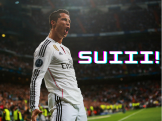

# Head Soccer Game in Assembly C



## Overview

This project is a simple head soccer game implemented in Assembly C. It aims to provide an entertaining and interactive experience for players who enjoy classic arcade-style games. The game features intuitive controls and a challenging AI opponent, offering players an opportunity to test their skills in a fun and engaging environment.

## Features

- **Player vs. AI Mode**: Compete against a computer-controlled opponent in exciting one-on-one matches.
- **Realistic Physics**: Experience realistic ball movement and player animations for an immersive gaming experience.
- **Dynamic Difficulty**: The AI adapts its skill level based on the player's performance, providing a challenging yet fair gameplay experience.
- **Score Tracking**: Keep track of your wins, losses, and overall performance with the built-in scoring system.
- **Customizable Controls**: Adjust the controls to suit your preferences and play style for maximum comfort and enjoyment.

## Getting Started

### Prerequisites

- **Assembler**:Run the code on the following nios II emulator https://cpulator.01xz.net/?sys=nios-de1soc&d_audio=.

### Installation

1. Clone the repository to your local machine:

   ```bash
   git clone https://github.com/yourusername/head-soccer-assembly-c.git


### List of Tasks
a)Fix Direction of character (done)
->Replace All magic numbers with defined numbers (done)

b) Create Jump Logic (done)

c) need to create gravity (done)

Ball Collision Logic (somewhat works)
1. Just Set the structs as globals and check as needed (done)
2. Store the sizes of the images in structs (stored as the macro definitions search "Declarations" in file)
3. 


 ) Add Player 2 (done)

d) Character Kick (done)

e) Update the background (extra)

f) Goal Post Boundaries (done)

g) Start page 
   - option to select pvp vs cpu

h) Timer (done)

i) we need to wrap everything in the current main loop in a separate function, so we can if we want to again after end game, we should wrap 

f) goal scene (done)


start menu -> allow to chose options
win screen for player 1 and player 2


complexity for ball speed

